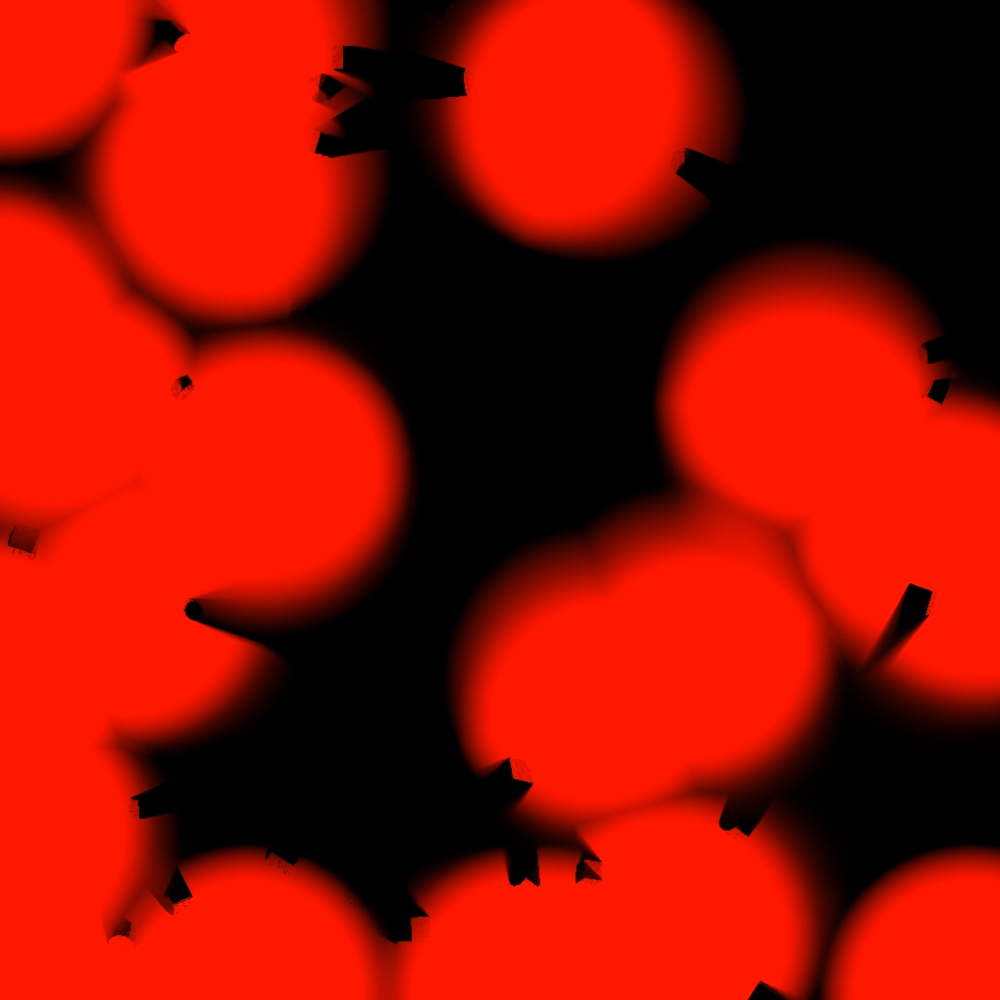

# Concepts

## Subsystem

All the relevant data is managed within and through the **FOW Subsystem**, which is a **World Subsystem**. One instance exists per game world (client or server). 
Even though the subsystem has mostly only visual use-cases, it is still created on the server, as it can be used to drive game mechanics. It is created automatically when the world initializes and is destroyed with the world.

---

## Fog Instances, Textures & Profiles
The system allows the creation of multiple, self-contained **Fog Instances**, each covering a certain area in space and consisting out of their own resources and runtime-setting.
For each of the existing areas, the plugin writes a mask into one distinct render target. 

### Render Target Texture
By mapping these textures over their corresponding areas, shaders can use it to control different parameters, like translucency or colour. 
Like this, each render target texture can be used for many different effects, like the plugins premade fog variants.

Moreover, by reading back the textures value at the pixel which maps to a certain position, the CPU can also query the mask to control game mechanics. The plugin uses this for example to blend actors in or out. 

Logically, the higher the resolution and the smaller the covered area, the greater the quality.
Additionally, the system allows to downscale the actual resolution used when computing the mask, which generally works best when transitions are kept smooth.

To make these textures usable in shaders, the system also forwards additional data to them via material parameter collections or registered dynamic materials.

As already mentioned, the system allows the usage of multiple Fog Instances, each using their own profile. However, it is still recommended to keep the count of the different Fog Instances within the system as little as possible, as the render pipeline is executed for each one individually. 
Merging close by Fog Instances together, might result in the corresponding Render Target covering wide ares
to use just one render target.  Profiles can either be added within the project settings or created as Data Assets and added during runtime.

### Material Parameters (MPC & Dynamic MIDs)

For every active Fog Instance, the subsystem pushes data to its MPC and MIDs via the selected **parameter names**. The default names are as follows. However, for additional profiles these names are customizable.

- `FOW_Enabled`(If the Fog System is currently updating this Fog Instance )
- `FOW_FogCenter` (Origin World XYZ)
- `FOW_FogSize`   (XYZ full size)(while the XZ axis map the render target into the world, the Z axis is only needed for certain fog visualizations)
- `FOW_FogYawDegrees`
- `FOW_ActorVisCutoff` (Highest mask value the system treats as hidden)
- `FOW_RT` (Texture param for the Fog Instance ’s render target, only on dynamic materials)

You can create or aquire the registered **MID** already bound to a Fog Instance  for a certain material via the Subsystem.

### Covered Area

Each Fog Instance  tracks its placement as a 2D oriented box in world space:

- **Center** (XYZ)
- **Extends** (full size XYZ; not half-extents)
- **YawDegrees** (rotation in the plane)

At runtime you can set or expand the area via the Subsystem (e.g., `SetFogInstanceArea`, `ExpandFogInstanceAreaToInclude`).

###  Profiles & Runtime Controls 

Each entry in the **Fog Instances** has its own name, assets, state and settings. The initial settings and assets can either be setup before runtime through the project settings, findable in **Project Settings → Plugins → Fog Of War**, or
during runtime. At runtime, new entries can be added either purely through the subsystems functions, or by applying a **FOW Profile** data asset, which can be used to save certain setups.

Per default the plugin only contains one render target asset and one MPC. Additional areas require their own, unique render target and asset, which have to be manually created and hooked up.
**Primary FogInstance** is the default Fog Instance, using the plugins internal render target and MPC. 

Core runtime flags and values can be set before or changed during runtime per Fog Instance. The most important ones are as follows:

- **Enable/Disable** Fog Instance  updates and presentation
- **Show Fog** (final visibility overlay)
- **Freeze State** (stop recomputing current state; blending still happens)
- **Show Memory** (ever-seen contribution)
- **Freeze Memory** (stop accumulating new exploration)
- **ExploredValue** (brightness of explored areas, also used by queries if desired)
- **SmoothFallOff** (edge softness of vision)
- **Blur**: `BlurIterations`, `BlurRadius`, `BlurSigma`
- **Actor Visibility Cutoff** (0..1) - used by GPU queries and stealth logic
- **Update Rate (seconds)** -cadence for recomputation (blending runs every tick)

---

## Vision & Blockers

A Fog Instances visibility mask is recomputed dependent on its **update cadence**, using the following inputs:

1) **Vision** → describes the areas where the revealing happens (position, radius, falloff).
2) **Blockers** → write *occlusion* textures (coverage/height and optionally distance field).
3) **Ray Method** → traces from vision origin over the occlusion textures to compute the final mask.

### Vision Sources
There are two ways to add vision sources to the system. One static, and one dynamic. 

- **Vision Actors** (dynamic): A circular, smooth falloff around the actor’s location. Allows to add an **Eye Offset**, increasing the height of its origin. Increasing this is necessary, if the vision actor itself writes occlusion, in order to prevent it from occluding itself.
- **Static Vision** (placed markers): Same circle without an owning actor.

### Blockers (Occluder Mask)
Blockers contribute to occlusion in two possible ways:

- **Circle** - Simple radial blocker around a position with an endless height. <!-- Should allow it to have a certain height-->

- **Capture Writer** - A SceneCapture that writes **height** (and coverage) into the occluder textures for its **Fog Instance**.
    - Use for irregular geometry (walls, cliffs, buildings, ships).
    - You can switch between:
        - **ShowOnly mode** - Only considers certain registered actors.
        - **Full scene** - Everything that the capture sees contributes.

The scene capture is placed very far above the Fog Instances area, capturing down the z-axis, using an orthographic projection. 
If anything is above the wanted occluders, blocking them from being rendered into the capture, it is necessary to use the ShowOnly mode. 

If the ShowOnly mode also gives the option to only update the system, when any of the registered actors changed their position. This should only be turned on, as long as their are no other changes to the actors final geometry (components, vertex offsets, etc.).

### Occlusion Modes & Ray Methods
To figure out occlusion, the system allows the usage of many different Ray Methods, each shining within a different use case. Dependent on the method, the occlusion textures consist out of a height texture, a max mip chain of coverage masks and a distance field texture.

- **Step Scan**  
  March 1 px per step over the coverage/height textures.  

- **DDA (Grid DDA)**  
  Traverses the base coverage/height grid cell-by-cell.  

- **Hierarchical DDA (recommended if occlusion changes often)**  
  Marches over the **coverage mip chain**, skipping empty parents; (confirms at mip0 optionally with height).  
  *Pros:* fast in sparse scenes or with pure coverage occlusion, recalculation of textures is cheap. *Cons:* many unnecessary texture reads and steps if height is not blocking.

- **Distance Field (recommended if occlusion changes rarely)**  
  Trace using a precomputed distance field (with `DFScale`) and optionally confirm with height.  
  *Pros:* very fast in open areas and when blockers change infrequently. *Cons:* requires DF generation.

> **Tips**
> - Start with **Hierarchical DDA**.
> - Switch to **Distance Field** if occlusion rarely changes (tune `DFScale`).
> - If height occlusion is necessary and many occluders below the vision sources height exist, consider switching to either **DDA** or **Step Scan**.
> - Use **Capture Writer** for complex occluders; **Circle** for cheap bulk obstacles.

---

## Stealth, Visibility & Ghosts
The Fog system produces a per-pixel **visibility value** in each Fog Intances mask. Additional to driving the visual appearance of effects like fog, this value can be used to drive game mechanics.
As the mask texture is computed on the GPU, to get this information on the CPU, the system uses GPU-to-CPU readbacks.

### Visibility Queries
The system allows for two different types of queries. One happening on the CPU, which just looks up if a certain position is within the registered vision sources radius. This version does not actually check the current status of the Fog Instances mask.
This means it does not take into account occlusion, fade in/out or any other effect. However, in contrast to the GPU-based query, it does not have any latency.

The other version is a GPU-based query, which uses the masks visibility value to determine if a certain position is visible. This is the recommended way to use the system for gameplay. 
Firstly, the CPU checks, inside which Fog Instance the position is, and then queries that texture for the exact value. If multiple Fog Instances cover the point, the first one gets samples.

This function comes in both a single-query and a batched version.
It is highly recommended to use the batched version if possible, as each query depatches its own compute shader. <!-- Should do this automatically-->

However, to accomplish the GPU-based queries, the plugin uses GPU-to-CPU readbacks.

#### What is a "CPU readback"?
After the compute passes have finished calculating the visibility mask, the visibility results requested live in GPU memory. A **readback** is the asynchronous transfer of a small results buffer **from GPU to CPU** so your Blueprint/C++ code can use it.
The system **never reads back the full Fog texture** for queries. Instead, it samples the Fog RT **on the GPU**, writes the requested values into a compact results buffer, and only that buffer is copied back. This keeps the readback size very small.
However, there is a small latency between issuing the readback and the results being available. GPU work is pipelined. The compute dispatch that fills the results buffer runs **after** any other queued draw/compute. The copy engine then transfers the tiny buffer to CPU-visible memory.
Waiting for the readback to finish would stall the game thread. Therefore, the system uses either latent functions or a handle system for the queries (also useable in Blueprint), to keep on checking every tick until the results are available. 

### Visibility Threshold (per Fog Area)
Each Fog Instance has an **Actor Visibility Cutoff** in the 0-1 range. If a sample at the actor’s position is greater or equal to this cutoff, the actor counts as *visible*, otherwise as *hidden*.
The query functions also return both the actual mask value, as well as the visibility flag using the Fog Instances cutoff value (or overriden cutoff value).

> **Tips**
> -  Keep the **Visibility Threshold** a bit above your explored/memory value as “remembered” areas are reached via a **lerp over time** (relax/forget), and never exactly hit it perfectly.

### Stealth Actors
Actors can be registered to the system to react to the visiblity value their world position receives. Each of these actors receives a stealth state. <!-- Should allow for an offset-->

####  Stealth Actor State (runtime)

Each registered actor keeps a small state struct:

- **bLastVisible (bool)** - Result of the last visibility check.
- **LastValue (float)** - The last sampled fog value at the actor’s position (0..1). Useful for edge-aware logic (e.g., “barely seen”).
- **LastKnownTransform (FTransform)** - The last transform the actor was visible at.
- **HideMode (EFOWHiddenMode)** - How to react when crossing the cutoff:
    - `Hide` → just hides the real actor.
    - `FreezeWithGhost` → hides the actor, but spawns a copy actor taking on the real actors last seen appearance.
- **VisibilityPolicy (EFOWVisibilityPolicy)** - Who decides visibility:
    - `FogDriven` → use fog queries (default).
    - `AlwaysVisible` / `AlwaysHidden` → makes it possible to force the actor to be visible/hidden.
- **StealthActorHideAtOverride (float)** - Optional per-actor cutoff override:
    - `< 0` → disabled (use Fog Area cutoff).
    - `>= 0` → use this value for this actor’s hide/show decisions.
- **Ghost (AFOWGhostActor\*)** - Weak reference to the spawned ghost; `HasGhost()`/`GetGhost()` helpers for safety.

The struct can be accessed from the subsystem via the `GetStealthActorState` function.

#### Stealth Component and Smooth Fade
Normally, these actors just get hidden or shown completely. However, using the **Stealth Component** allows for smooth transitions, fading them in/out. However they require a bit of setup in their material.

- Add one scalar **Fade Material Parameter** (e.g. `FOW_Fade`) to your materials to control its visibility. The component automatically uses this parameter to fade in/out.
- Set the components **Fade Seconds** to control the ease-in/out.

---

## Computing the Mask and Occlusion
The visibility within a Fog Instance is stored within an editor exposed render target. To get to the final fog mask, many different compute shaders are used.

### Blending and Updates
Real updates to the current visibility, using the visibility sources and occlusion textures, do not happen every frame. They happen only after a certain user-set period. However, to keep transition smooth, each tick still blends between the current fog state and the previous one, until it is truly updated again. This works best with smooth masks, which hides this blending effect.

These updates only happen if the Fog Instance is enabled or not frozen. Recalculating the visibility consists out of one necessary path and one optional path for the occlusion textures. The occlusion textures only get recomputed if necessary, if any of the blockers changed.

#### Recompute Rules
Occlusion is only rebuilt when needed. This is done either, when a blocker changed (dynamic or static), or when the capture has been marked dirty.

However, if the capture is not set to ShowOnly, only rendering certain actors into the capture, the capture and therefore the occlusion has to be rebuilt every time, as it is not feasible to check beforehand, if it is actually necessary.
This can be very costly and makes cheap tracing methods using the distance field suddenly very costly, as its costly recalulcation happens every time also.
Therefore, it is highly recommended to use the ShowOnly mode and if possible, enable the **bUpdateOnlyIfTransformChanged** flag. This allows the system to check if any of the registered actors changed their position, and only then recapture. 
Of course, this should only be used if the blocking actors appearance is only dependendable on the actors position (no components changes, no vertex offsets, etc.).

If ShowOnly and bUpdateOnlyIfTransformChanged are used, the recompute rules are as follows:

- **Blockers moved / added / removed** → mark **OcclusionDirty**.
- **Capture inputs changed** (ShowOnly list, transforms, enabled flags) or Show Only Actors moved → mark **CaptureDirty**.
- On the next visibility update:
    1. If **CaptureDirty** and capture is enabled → **Recapture** and mark **OcclusionDirty**.
    2. If **OcclusionDirty** → **Rebuild Occlusion Textures** (merge Circles + Capture).

Due to the slow blend in and out of visible areas, the visibility mask has to be recomputed every time its **update cadence** calls for it. However, the system allows to skip this recomputation, if non of the vision entries and occlusion textures changed.
This only works tho, if the transition rates are high enough, relative to the update cadence.  <!-- Should set it automatically-->

Now lets talk about the two different paths needed for the visibility computation..

### Visibility Pipeline

When a unit leaves an area, a *memory* texture marks it as already explored. These areas are represented by a darker value as currently visible areas within the final mask. Blending between visibility states happens smoothly (linear or exponential).

- **Relax Rate** controls how fast the memory value is reached.
- **Fade In Rate** controls how fast new areas are discovered.
- **Forget Rate** slowly reduces the memory value of areas that are no longer visible.

You can freeze/clear/hide memory per Fog Instance  at runtime.

### Visibility Pipeline

The visibility pipeline turns **vision sources** + **occluder textures** into the final fog mask for a Fog Instance. It runs as a sequence of lightweight compute passes, the whole pipeline being individually executed per Fog Instance. Between recomputes, the system **blends** between the old and the new version, to keep motion smooth.

#### 1) Inputs and Resources (per Fog Instance)
The whole pipeline takes the following inputs:

- **Vision data**: world-space center, range, optional eye-height offset for each source (actors or static revealers).
- **Optional pooled, precalculated occlusion textures**: **Coverage**, **Height** and **Distance Field** textures (from the occlusion pipeline).
- **The Fog Instances runtime state** (includes fog transform, LOD, fade rates etc.)

Still on the CPU, the vision data is projected into the textures UV space. This is done to keep the GPU from having to do these calculations for every local vision data per pixel again and again. 
All the intern textures within this pipeline depend on the Fog Instances LOD. It reduces the resolution of these textures and in the end upscales the final product to fit the render target.

#### 2) BuildTileBins (cull work per tile)
We partition the RT into a uniform tile grid and bin vision sources into the tiles they touch. Pixels only look at sources that could actually affect them, which keeps per-pixel loops tiny.

- Outputs:
    - `TileCounts[tiles]` - number of sources touching each tile.
    - `TileIndices[tiles * MaxPerTile]` - indices into the vision list.

#### 3) ComputeVisibility (reveal)
Per pixel, the compute shader:

- Pulls the **local source list** from its tile 
- If occlusion is enabled, performs the configured **ray method** using **Coverage/Height/DF** (see Occlusion Pipeline)
- Applies **smooth falloff** per source (controlled by `FallOffAmount`).
- Writes a linear **visibility** in `[0..1]` to `OutCurrentVisibility` (Fog RT at internal LOD).

#### 4) Blur (separable Gaussian)
To stabilize edges, most notably at occlusion, and hide aliasing at lower internal resolutions, the user gets the option to blur the visibility mask.

This is done by two passes. The user can choose to apply the blur multiple times by turning up `Blur Iterations`.:

- Two passes (X then Y) with `Radius` and `Sigma`.
- Output is a **blurred visibility** mask.

#### 5) MergeFOWMemory (maintain explored state)
Maintains a **memory** texture that tracks “already explored” areas:

- Logic: where there is **no** current visibility, memory **decays** toward `0.0` at `ForgetRate`. Where there **is** visibility, memory is kept/raised.
- Output: **MemoryMask** for this instance.

#### 6) ComposeFog (combine visibility + memory)
Composes the final fog value into the previous state according to fade rates.

- Composition logic:
    - **FadeInRate** - how fast newly seen pixels rise toward **1.0**.
    - **RelaxRate** - how fast pixels fall back toward **memory** after vision is lost.
    - **ExploredValue** - baseline for “remembered” pixels (darker than fully visible).
    - **ShowMemoryAlpha** - how much the memory layer contributes visually (used to toggle memory on and off).
- Output: **Composed Fog** (internal LOD).

#### 7) Upscale (optional)
If you render the Fog internally at a lower resolution (`LOD`), an **upscale** pass resamples it to the output RT used by materials (bilinear).

#### 8) Per-tick Blend (between recomputes)
Even when the cadence decides **not** to recompute, the system still runs a tiny **blend** each tick.  This hides steps and produces a smooth, more continuous feel:

- `Final = lerp(PrevFinal, Composed, t)` with `t ≈ TimeSinceLastRecompute / UpdateRate`.

### Occlusion Pipeline

The occlusion path bakes **blockers** and the height capture into a few GPU textures that the visibility pass can ray against. As already mentioned, it only recomputes when necessary.
Additionally, it only computes the textures the ray marcher actually needs. For example, the distance field is only computed if the visibility pipeline actually uses it.

## Inputs (per Fog Instance)
- **Blockers** (static + dynamic): world-space center, radius, optional height.
- **Instance state**: fog transform, internal LOD/resolution, used features, etc.

## Output Textures
- **Coverage** (binary mask): where blockers occupy pixels. For certain ray march types, a max-reduction mip chain is generated so rays can quickly skip empty regions.
- **Height**: the height of the blockers at a given pixel.
- **Distance Field**: unsigned Euclidean DF from Coverage.

## Steps

At first, still on the CPU, the blockers are projected into the textures UV space. 

1. **Rasterize Blockers → Coverage / Height**  
    The first pass rasterizes the blockers and merges them with the capture. This is done by a single compute shader. It writes the height texture, as well as the top level of the coverage mip chain.

2. **Build Mips (Max‑Downsample)**  
   If **Hierarchical DDA** is used for the ray marching, this pass builds a max pyramid (2×2) so the ray marcher can skip empty regions quickly.

3. **Make Distance Field (from Coverage)**
    The distance field has to be built in multiple passes. To keep performance reasonable, the system allows reducing the DFs resolution even further, down from the already existing LOD, using a **DFScale** factor.
    - **Seed Pass**: write seed coords at covered pixels.
    - **Relaxation Pass**: propagate best seeds (few iterations).
    - **Distance Pass**: convert seeds → float distance per pixel.

4. **Pool & Reuse**  
   Textures are pooled per size. If nothing changed, instances reuse existing occlusion textures.
