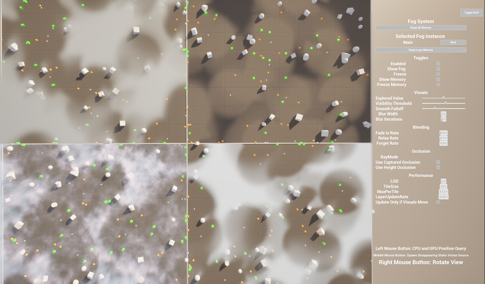
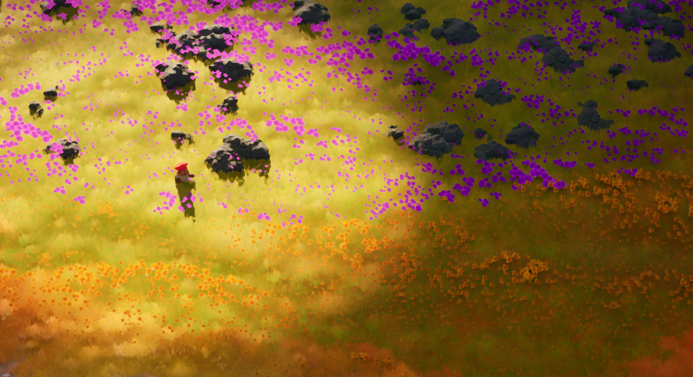
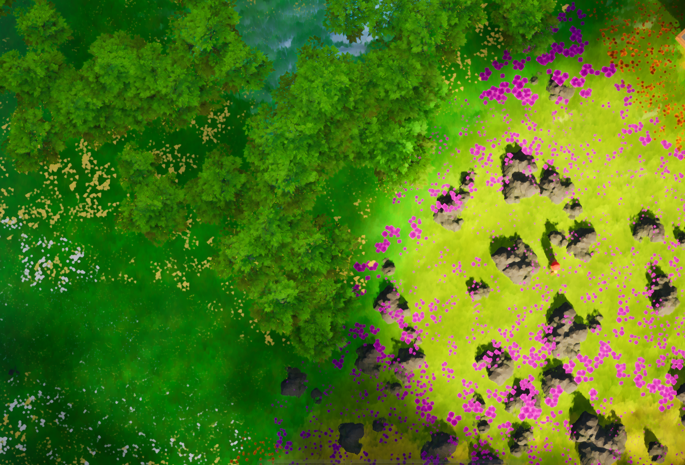
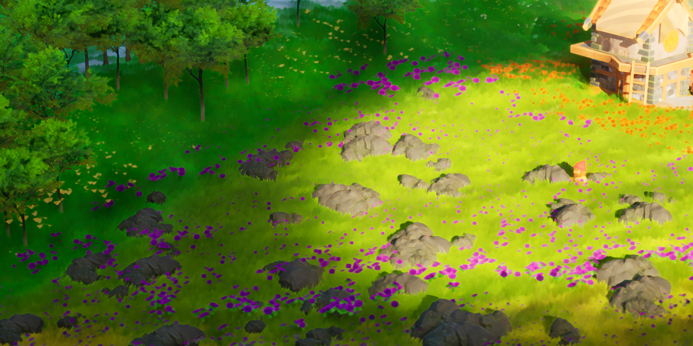
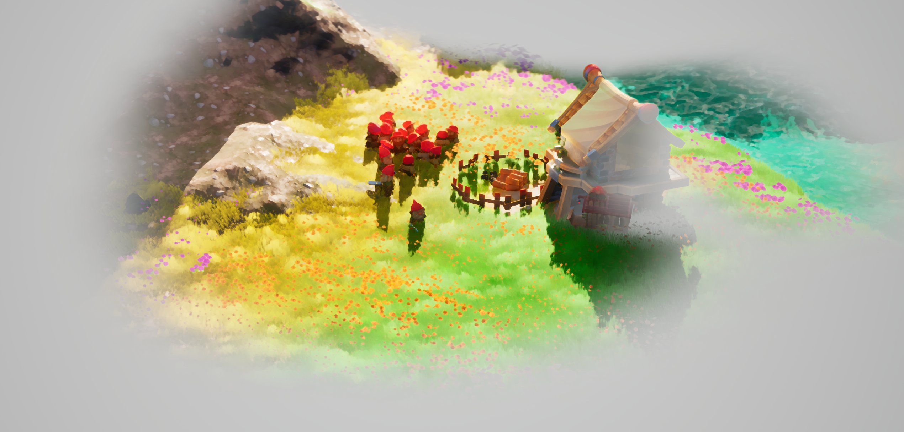

# GPU Fog of War for Unreal Engine 5

Welcome to the **tech blog + documentation** for my UE5 Fog of War plugin.

Its a **GPU - Fog of War** system developed for our Game Project "Obscura". The Fog of War for our game had to show a high fidelity, good performance and allow for different gameplay options.
The resulting system features memory for already discovered areas, different hide modes for actors, heightaware occlusion and visibility queries. Great performance, even with a multitude of vision sources, is achieved by the use of compute shaders.
It is also Blueprint‑friendly and multiplayer‑safe.

## Highlights
- **Excellent Performance** through compute shaders. 
- **Height‑aware occlusion** (capture component + different ray modes).
- **Memory** for already explored areas.
- **Actor Freeze and Hide Mechanics** Smoothly hides or freezes actors when outside the view area (even after destruction).
- **Actor-Components** for ease of use: Vision, Blocker, Stealth.
- **Multiple premade Fog variants**: layered mesh, volumetric box, post-process, and light function.
- **Batched visibility queries** to get visibility info onto the CPU.
- **High Customizeability and Adaptability**: Multitude of User-Settings and -Options.
- **Blueprint‑friendly** and **Multiplayer‑safe**.

> ⚙️ **Supported**: UE5.x 

## Example Project

The available Example Project allows to play around with four different Fog Variants and the most important runtime settings via Widgets. The following screenshot shows Vision Sources (white cylinders), Actors hiding within the fog (green cubes), Actors freezing within the fog (orange spheres) and Actors occluding the vision.

## In-Game Screenshots

The following screenshots show different Fog Variants achieved with the plugin within our game "Obscura". The four variants are:

- Layered Meshes
- Light Function
- Post-Process
- Volumetric Box

The Fog Types are shown in this order (except volumetric box) and are also easily setup using the Plugins *FOW-Manager*. However, fully customized Fog Types can be created using the plugin's API.

### Layered Meshes

This cheap "fake" volumetric fog is achieved by layering multiple meshes on top of each other. This type of fog is allows for high fidelity with good performance, but breaks down when looking at it from too steep angles.

### Light

By using Unreal's Light Function, the system can block light within unseen areas.

### Post-Process
The system can also be used to create Post-Process effects to hide invisible areas.

---

## Quick links
- [Quickstart](fog-of-war/quickstart.md)
- [Concepts](fog-of-war/concepts.md)
- [API Reference](fog-of-war/api.md)
- [Performance](fog-of-war/performance.md)
- [FAQ](fog-of-war/faq.md)
